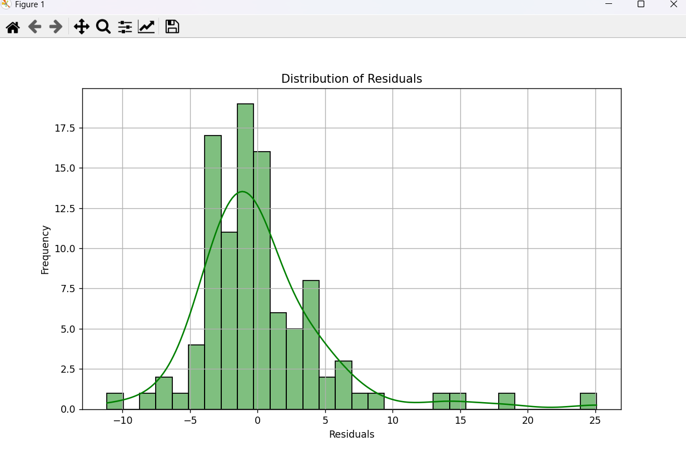

# House-Price-Prediction

This project predicts housing prices using the Boston Housing Dataset. The prediction is based on features such as crime rate, number of rooms, and more, using a Linear Regression model. The project also includes visualizations to help evaluate the model's performance.

---

## Features
- **Linear Regression Model**: Predicts housing prices based on multiple features.
- **Evaluation Metrics**:
  - Mean Squared Error (MSE)
  - R-squared (R²) score
- **Visualizations**:
  - Histogram of actual vs. predicted prices
  - Scatter plot of predictions vs. actual values
  - Residual plot for error distribution

---

## Prerequisites
Before running this project, make sure you have:
- Python 3.7 or higher
- Required Python libraries:
  - `pandas`
  - `numpy`
  - `scikit-learn`
  - `matplotlib`
  - `seaborn`

Install dependencies with:
```bash
pip install pandas numpy scikit-learn matplotlib seaborn
```

---

## Dataset
- **File**: `boston.csv`
- **Description**: Contains housing-related data for regression analysis.
- **Key Columns**:
  - `PRICE`: The target variable representing house prices.
  - Other columns include `CRIM`, `ZN`, `RM`, `AGE`, `TAX`, and more.

---

## How to Run
1. Clone the repository:
   ```bash
   git clone https://github.com/ayushraj6824/House-Price-Prediction.git
   ```
2. Navigate to the project directory:
   ```bash
   cd House-Price-Prediction
   ```
3. Ensure the `boston1.csv` file is present in the directory.
4. Run the script:
   ```bash
   python main.py
   ```
5. View the evaluation metrics and generated visualizations.

---

## File Structure
```plaintext
House-Price-Prediction/
├── main.py          # Main script for running the prediction model
├── boston.csv       # Dataset file
├── README.md        # Project documentation
```

---

## Screenshots
### 1. **Actual vs. Predicted Prices (Histogram)**  
   ![Actual vs Predicted Prices] (Screenshots/Screenshot1.jpg)

### 2. **Predicted vs. Actual Prices (Scatter Plot)**  
   .jpg)

### 3. **Residual Plot**  
   

---

## Example Output
**Model Evaluation:**
```plaintext
Mean Squared Error: 24.29
R-squared Score: 0.76
```

### Generated Visualizations:
1. **Histogram of Actual vs Predicted Prices**
2. **Scatter Plot of Predictions vs Actual Values**
3. **Residual Distribution Plot**

---

## Contributing
Contributions are welcome! Feel free to fork this repository and submit a pull request with improvements or suggestions.

---

## Contact
**Author**: Ayush Kumar  
**GitHub**: [ayushraj6824](https://github.com/ayushraj6824)  
**Email**: [ayushraj.s7870@gmail.com]  

---

Save this file as `README.md` in the root directory of your project. Let me know if you need further modifications!
